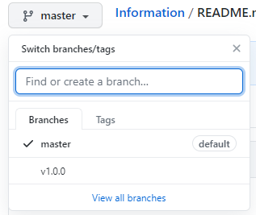

# How to make contributions

There are many ways to contribute to your team. With the help of GitHub, your collaboration will be more secure,
efficient and asynchronous.

## Fork

Clicking the following button (usually on top right corner) will duplicate the entire repository to your own account.

'

Check [here](https://docs.github.com/en/github/getting-started-with-github/fork-a-repo) about how to fork on GitHub Desktop.

**Note**:
Please consider branching if you are working as a team.
Check [here](./instruction_github_basic.md) for instructions about branching.

## Make a pull request
Instead of merging your contributions to master branch directly, it is better to make a pull request.
A pull request proposes your changes and allows collaborators to review the changes by [code review](#Code Review)

You can make a pull request from a branch or a forked repository.

To make a pull request from a branch: 

1. Navigate to your repository

2. Select your branch <br>


3. Click pull request button  <br>


4. It opens up a new page where you can add additional information for your pull request

5. Select the destination branch and click `Create pull request`  <br>

    
6. Fill in the title

7. Write some comments if necessary

8. Select reviewers by clicking `Reviwers` and click `Create pull request  <br>


To make a pull request from a forked repository, start from the third point of making a pull request from a branch.

Check [here](https://docs.github.com/en/github/collaborating-with-issues-and-pull-requests/creating-a-pull-request-from-a-fork) for
more information about creating a pull request from a fork.


## Code Review

The reviewers selected during making a pull request can review the code changes.

Click the `File Changes` tab to list the changed files <br>


Hover over the changed file, you can leave a comment by clicking the plus button <br>


After finishing review, you can just leave some comments, approve the pull request or mark "Request changes".

Once every reviewer approves your pull request, you can try to [merge](#Merging) your pull request.

Check [here](https://docs.github.com/en/github/collaborating-with-issues-and-pull-requests/about-pull-request-reviews) about pull request reviews.

## Merging

Merging a pull request can merge the code changes to the destination branch.
Different repositories have different rules for merging. Some may need at least one reviewer to approve your pull
request. As our course progresses, it may also need a passing CI.

You can click the merge button to merge your pull request. <br>


## Code conflicts

During merging, you may experience code conflicts.

> Merge conflicts happen when you merge branches that have competing commits, and Git needs your help to decide which changes to incorporate in the final merge.

You have to make another commit to address the conflicts before merging.
There are a variety of ways to resolve conflicts.
The best way is to merge the base branch to your local branch, either Git or GitHub Desktop will let you know which have conflict issues.
The conflicts will look like the following:
```
<<<<<< HEAD
Base change
=======
Local change
>>>>>> local-branch
```
In you text editor, you can choose to keep your local changes, keep base changes or merge them.

